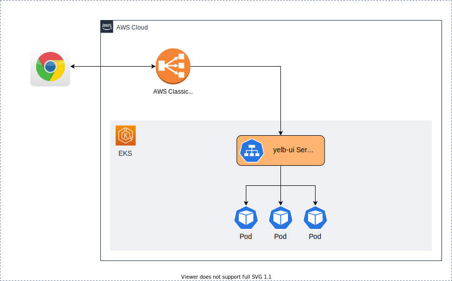
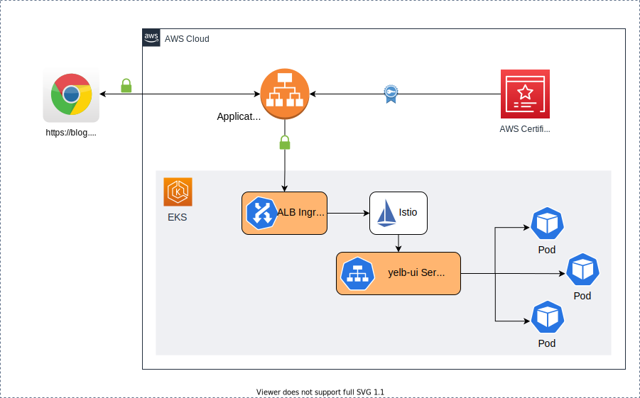

# Secure end-to-end traffic on EKS using TLS certificate in ACM, ALB and Istio

[Istio](https://istio.io/) is one of the popular choices for implementing a service mesh to simplify observability, traffic management and security. 
Customers are adopting Amazon EKS to scale their Kubernetes workloads to take advantage of flexibility, elasticity, and reliability of AWS platform. 

I was helping a customer to migrate their Kubernetes workload from their on-premises data-center into AWS. Customer wished to keep using Istio as their preferred Service. However, they were struggling to implement end-to-end encryption using certificate in Amazon Certificate Manager (ACM) and Istio in EKS environment. I have noticed this was common ask by community, so decided to write a blog about it.

In this blog post, I will focus on how take advantage of AWS services to implement end-to-end encryption using TLS certificates in ACM, Elastic Application Load Balancer and Istio as service mesh. However, before going into details, I have made few assumptions.

## Assumptions and pre-requisites:

* Existing AWS account with proper permissions.
* Existing and working EKS cluster with Kubernetes v1.21
* Installed and configured latest versions of utilities on the workspace you will use to interact with AWS and EKS cluster
    * [aws cli](https://aws.amazon.com/cli/)
    * [eksctl](https://eksctl.io/)
    * [helm](https://helm.sh/)
    * [git](https://git-scm.com/downloads)
    * [openssl](https://www.openssl.org)
    * [istioctl](https://istio.io/latest/docs/setup/getting-started/)
    * [kubectl](https://kubernetes.io/docs/tasks/tools/#kubectl)
* AWS [Load Balancer Controller](https://kubernetes-sigs.github.io/aws-load-balancer-controller) v2.3 or newer is installed and configured on your EKS cluster. 
* Existing and valid certificate in AWS Certificate Manager (ACM). You can [request](https://docs.aws.amazon.com/acm/latest/userguide/gs-acm-request-public.html) one if not available. 


I will demonstrate installing a sample Kubernetes application called yelb and expose it using Kubernetes service of type load balancer. Later, I will configure ALB ingress controller to pass this traffic to Istio for further processing.


> Note: I am using Bash terminal for code, but it is not strictly a required. Example code can be easily tweaked for Microsoft Windows Terminal. 


### Install yelb application

```bash

git clone https://github.com/saleem-mirza/eks-alb-istio-with-tls

cd eks-alb-istio-with-tls

kubectl apply -f yelb-k8s-loadbalancer.yaml
```

Let's visualize our current state of application.



Our future state of applications is to configure TLS certificate from ACM with Application Load Balancer (ALB) to encrypt inbound traffic. We also want to take advantage of Istio for traffic routing and mTLS  inside EKS cluster. The target state of cluster will look like:



### Install and configure Istio

I am installing Istio using ``istioctl`` and change service type of ``istio-ingressgateway`` to ``NodePort``. The service type of NodePort is required when forwarding traffic from ALB to EC2 instances.

```bash
istioctl install \
--set profile=demo \
--set values.gateways.istio-ingressgateway.type=NodePort
```

Verify Istio installation using `kubectl get po -n istio-system`, you should see pods running. Next, attach label to  ``default`` namespace. This will tell Istio to inject proxy sidecar to pods running in namespace. You will need to delete existing pods in default namespace. 

```bash
# label default namespace
kubectl label default ns istio-injection=enabled —overwrite

# delete existing pods so that Istio can inject sidecar
kubectl delete po --all

# get list of pods
kubectl get po
```

You will notice that there are two containers running in each pod. 


### Generate self-signed TLS certificates

Generate self-signed certificate. We will use key/pair to encrypt traffic from ALB to [Istio Gateway](https://istio.io/latest/docs/reference/config/networking/gateway/). 

```bash
openssl req -x509 -newkey rsa:4096 -sha256 -days 3650 -nodes \
  -keyout certs/key.pem -out certs/cert.pem -subj "/CN=yourdomain.com" \
  -addext "subjectAltName=DNS:yourdomain"
```

Generate Kubernetes secret containing ``key.pem`` and ``cert.pem``. We will use it with Istio Gateway to implement traffic encryption.

```bash
kubectl create -n istio-system secret generic tls-secret \
--from-file=key=certs/key.pem \
--from-file=cert=certs/cert.pem

```

### Configure Istio Gateway and Virtual Services

I will configure traffic routing for Istio using gateway and virtual services.

```bash
# install and configure Istio gateway 
kubectl apply -f istio/gateway.yaml

# install and configure external service
kubectl apply -f istio/external-services.yaml

# install and configure Istio virtual services for yelb
kubectl apply -f istio/yelb-services.yaml
```

I have attached self-signed certificates to Ingress Gateway. Istio will use these certificates to encrypt traffic between ALB and Istio which is key part to implement end-to-end encryption.

Let's look at Istio Gateway.

```bash 
cat istio/gateway.yaml
```

```yaml
apiVersion: networking.istio.io/v1alpha3
kind: Gateway
metadata:
  name: yelb-gateway
spec:
  selector:
    istio: ingressgateway
  servers:
    - port:
        number: 443
        name: https-443
        protocol: HTTPS
      tls:
        mode: SIMPLE
        credentialName: "tls-secret"
      hosts:
        - "*"
```
You will notice that I am using Kubernetes secret named `tls-secret` as `credentialName` which we generated earlier. The secret contains openssl generated key/cert. Gateway `yelb-gateway` is listening on port `443` for encrypted traffic.

### Configure ALB Ingress Resource

Istio can not use TLS certificate in ACM directly. However, I will use ACM certificates with AWS Application Load Balancer to terminate HTTPS traffic and then forward to Istio ingress gateway for further processing. 

I need ``arn`` of ACM public certificate and domain configured in Route53. I’ll create [ingress](https://kubernetes.io/docs/concepts/services-networking/ingress/) resource to receive traffic from ALB and forward to Istio gateway. You will need to edit ingress resource to configure annotations for AWS Application Load Balancer with TLS certificates.
To make it simple, I have created a helm chart which accepts ACM certificate `arn` and host name as parameter; generate and install ingress correctly.


```bash
helm install alb-istio-ingress ./helm/ALB-Istio-TLS \
--set host=blog.yourdomain.com \
--set certificate_arn=arn:aws:acm:xxxxxx:999999999999:certificate/xxxxxxxxx
```

> Note: Make sure to use your own valid domain and certificate **arn**.


Once ingress is installed, it will provision AWS Application Load Balancer, bind it with ACM certificate for HTTPS traffic and forward traffic to Istio resources inside EKS cluster. You can get generated manifest of Ingress resource using

```bash
kubectl get ingress gw-ingress -n istio-system -o yaml
```

The generated output will look like snippet below. Note values corresponding to `alb.ingress.kubernetes.io/backend-protocol` and `host` fields.

```yaml
apiVersion: networking.k8s.io/v1
kind: Ingress
metadata:
  annotations:
    kubernetes.io/ingress.class: alb
    alb.ingress.kubernetes.io/scheme: internet-facing
    alb.ingress.kubernetes.io/healthcheck-path: /healthz/ready
    alb.ingress.kubernetes.io/healthcheck-port: traffic-port
    alb.ingress.kubernetes.io/backend-protocol: HTTPS
    alb.ingress.kubernetes.io/listen-ports: '[{"HTTP": 80}, {"HTTPS":443}]'
    alb.ingress.kubernetes.io/actions.ssl-redirect: |
      {
        "Type": "redirect", 
        "RedirectConfig": { 
          "Protocol": "HTTPS", 
          "Port": "443", 
          "StatusCode": "HTTP_301"
        }
      }    
    alb.ingress.kubernetes.io/certificate-arn: |
      arn:aws:acm:xxxxxx:999999999999:certificate/xxxxxxxxx
  name: gw-ingress
  namespace: istio-system
spec:
  rules:
  - host: blog.yourdomain.com
    http:
      paths:      
      - backend:
          service:
            name: ssl-redirect
            port: 
              name: use-annotation
        path: /    
        pathType: Prefix  
      - backend:
          service:
            name: istio-ingressgateway
            port: 
              number: 15021
        path: /healthz/ready
        pathType: Prefix
      - backend:
          service:
            name: istio-ingressgateway
            port: 
              number: 443
        path: /
        pathType: Prefix
```

Get ALB Load balancer DNS and make note of it.

```bash
echo $(kubectl get ingress gw-ingress -n istio-system \
-o jsonpath="{.status.loadBalancer.ingress[*].hostname}")
```

We should get output similar to this 

```bash
k8s-istiosys-xxxxxxxxxxxxxxxxxxx.us-east-1.elb.amazonaws.com
```

### Create DNS record in Route53

Create a record in Route53 to bind your domain with ALB. Make sure you are creating DNS record in corresponding hosting zone, matching domain name.
I have compiled list of useful resources to learn more about DNS records and hosting zones in AWS.

* [Registering domain names using Amazon Route 53](https://docs.aws.amazon.com/Route53/latest/DeveloperGuide/registrar.html)
* [Working with public hosted zones](https://docs.aws.amazon.com/Route53/latest/DeveloperGuide/AboutHZWorkingWith.html)
* [Working with records](https://docs.aws.amazon.com/Route53/latest/DeveloperGuide/rrsets-working-with.html)
* [Routing traffic to an ELB load balancer](https://docs.aws.amazon.com/Route53/latest/DeveloperGuide/routing-to-elb-load-balancer.html)


It can take few minutes to populate DNS servers. Open blog.yourdomain.com in web browser, you will notice pad lock in address bar for secure TLS communication. We have a Kubernetes application running in EKS with end-to-end encryption enabled using TLS certificate from ACM, Application Load Balancer (ALB) and Istio.


### ****Cleaning up****

To avoid incurring future charges, delete the resources.
