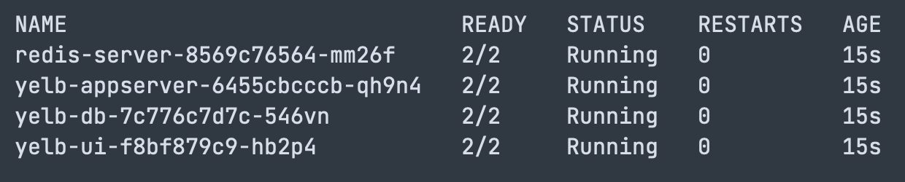
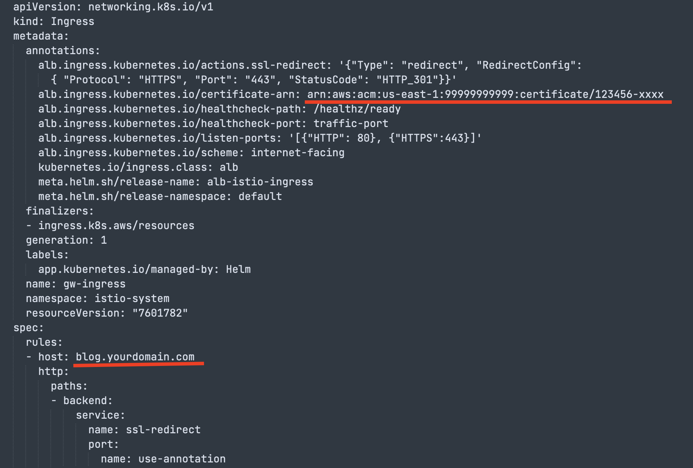
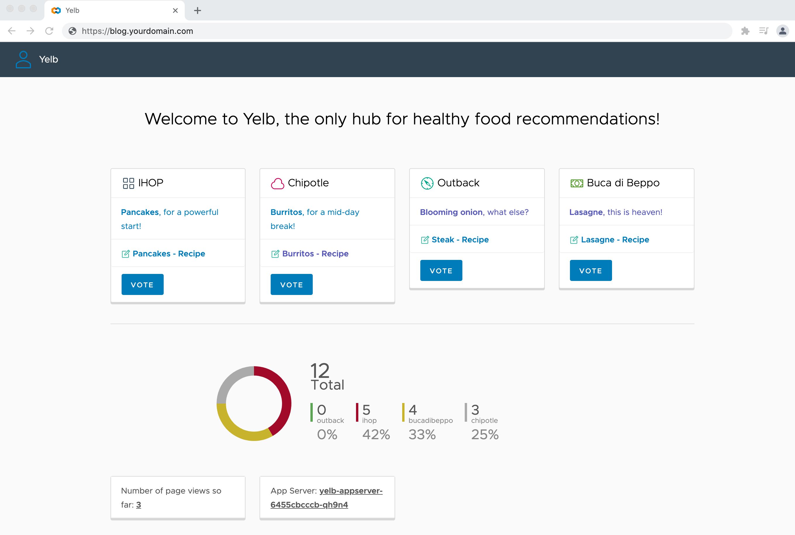

# Secure EKS traffic with ACM, ALB and Istio

[Amazon Elastic Kubernetes Service (Amazon EKS)](https://aws.amazon.com/eks/) is a managed Kubernetes service that makes it easy for you to run Kubernetes on AWS and on-premises. Amazon EKS is certified Kubernetes conformant, so existing applications that run on upstream Kubernetes are compatible with Amazon EKS.
 
With Amazon EKS, you can take advantage of all the performance, scale, reliability, and availability of AWS infrastructure, as well as integrations with AWS networking and security services, such as [Application Load Balancers](https://aws.amazon.com/elasticloadbalancing/application-load-balancer/) for load distribution, Identity Access Manager (IAM) integration with role-based access control (RBAC), [Amazon Certificate Manager (ACM)](https://aws.amazon.com/certificate-manager/) to easily provision, manage, and deploy public and private Secure Sockets Layer/Transport Layer Security (SSL/TLS) certificates for use with AWS services and your internal connected resources. 
 
With AWS Certificate Manager, there is no additional charge for provisioning public or private SSL/TLS certificates you use with ACM-integrated services, such as Elastic Load Balancing and API Gateway. Amazon Elastic Kubernetes Services (Amazon EKS) is leading platform of choice for customers of all sizes, to run their most sensitive and mission critical applications because of its security, reliability, and scalability. 
 
On the other hand, [Istio](https://istio.io/) is one of the popular choices for implementing a service mesh to simplify observability, traffic management and security. While helping customers to take advantage of Amazon EKS flexibility, elasticity, and reliability, customer has asked me to help in integration of Istio with AWS services, especially TLS certificates in ACM.
 
In this blog post, I will focus on how take advantage of AWS services to encrypt in-bound traffic using TLS certificates in ACM and Elastic Application Load Balancer. HTTPS traffic will be terminated on ALB and then forward to Istio for further processing to take advantage of traffic management, [mTLS](https://en.wikipedia.org/wiki/Mutual_authentication), and observability. However, before going into details, I have made few assumptions.

## Assumptions and pre-requisites:

* Existing AWS account with proper permissions.
* Existing and working EKS cluster with Kubernetes v1.21
* Installed and configured latest versions of utilities on the workspace you will use to interact with AWS and EKS cluster
    * [aws cli](https://aws.amazon.com/cli/)
    * [eksctl](https://eksctl.io/)
    * [helm](https://helm.sh/)
    * [git](https://git-scm.com/downloads)
    * [istioctl](https://istio.io/latest/docs/setup/getting-started/)
    * [kubectl](https://kubernetes.io/docs/tasks/tools/#kubectl)
* AWS [Load Balancer Controller](https://kubernetes-sigs.github.io/aws-load-balancer-controller) v2.3 or newer is installed and configured on your EKS cluster. 
* Existing and valid certificate in AWS Certificate Manager (ACM). You can [request](https://docs.aws.amazon.com/acm/latest/userguide/gs-acm-request-public.html) one if not available. 


I will demonstrate installing a sample Kubernetes application called yelb and expose it using Kubernetes service of type load balancer. Later, I will configure ALB ingress controller to pass this traffic to Istio for further processing.


> Note: I am using Bash terminal for example code but it is not strictly a required. Example code can be easily tweaked for Microsoft Windows Terminal. 


### Install yelb application

```bash

git clone https://github.com/saleem-mirza/aws-app-mesh-examples

cd aws-app-mesh-example/blogs/eks-alb-istio-with-tls

kubectl apply -f yelb-k8s-loadbalancer.yaml
```

Lets visualize our current state of application.


Our future state of applications is to configure TLS certificate from ACM with Application Load Balancer (ALB) to encrypt inbound traffic. We also want to take advantage of Istio for traffic routing and mTLS  inside EKS cluster. The target state of cluster will looks like:


### Install and configure Istio

 I will install Istio using ``istioctl`` utility. This will install Istio in ``istio-system`` namespace and configure ``istio-ingressgateway`` service of type load balancer. Since Istio does not directly support TLS certificates from ACM, I will put ALB in front of it. Traffic from ALB will be forwarded to Istio ingress gateway for further processing such as integration with mTLS, traffic routing etc.

```bash
istioctl install \
--set profile=demo \
--set values.gateways.istio-ingressgateway.type=NodePort
```

Verify Istio installation using `kubectl get po -n istio-system`, you should see pods running. Next, attach label to  ``default`` namespace. This will tell Istio to inject proxy sidecar to pods running in namespace. You will need to delete existing pods in default namespace. 

```bash
# label default namespace
kubectl label default ns istio-injection=enabled —overwrite

# delete existing pods so that istio can inject sidecar
kubectl delete po --all

# get list of pods
kubectl get po
```

You will notice that there are two containers running in each pod. 


Now, I will configure traffic routing for istio using gateway and virtual services.

```bash
# install and configure istio gateway 
kubectl apply -f istio/gateway.yaml

# install and configure external service
kubectl apply -f istio/external-services.yaml

# install and configure istio virtual services for yelb
kubectl apply -f istio/yelb-services.yaml
```

We have configured `istio-ingressgateway` as NodePort service, but it can not accept traffic without exposing Kubernetes worker node to the user. However, Istio can not use TLS certificate in ACM, I will use AWS Application Load Balancer to terminate HTTPS traffic and forward to Istio ingress gateway in EKS cluster for further processing.

We need ``arn`` of ACM public certificate and domain configured in Route53. I’ll create [ingress](https://kubernetes.io/docs/concepts/services-networking/ingress/) resource to receive traffic from ALB and forward to Istio gateway. You will need to edit ingress resource to configure annotations for AWS Application Load Balancer with TLS certificates.
To make it simple, I have created a helm chart which accepts ACM certificate `arn` and host name as parameter; generate and install ingress correctly.


```bash
helm install alb-istio-ingress ./helm/ALB-Istio-TLS \
--set host=[blog.yourdomain.com](http://blog.yourdomain.com/) \
--set certificate_arn=arn:aws:acm:xxxxxx:999999999999:certificate/xxxxxxxxx
```

> Note: Make sure to use your own valid domain and certificate **arn**.


Once ingress is installed, it will provision AWS Application Load Balancer, bind it with ACM certificate for HTTPS traffic and forward traffic to istio resources inside EKS cluster. You can get generated manifest of Ingress resource using

```bash
kubectl get ingress gw-ingress -n istio-system -o yaml
```

The generated output will look like snippet below. Note highlighted ACM certificate `arn` and domain name.


Get ALB Load balancer DNS and make note of it.

```bash
echo $(kubectl get ingress gw-ingress -n istio-system \
-o jsonpath="{.status.loadBalancer.ingress[*].hostname}")
```


We should get output similar to this 

```bash
k8s-istiosys-xxxxxxxxxxxxxxxxxxx.us-east-1.elb.amazonaws.com
```


Create a record in Route53 to bind your domain with ALB.


It can take few minutes to populate DNS servers. Open blog.yourdomain.com in web browser, you will notice pad lock in address bar for secure TLS communication. 


### ****Cleaning up****

To avoid incurring future charges, delete the resources.
